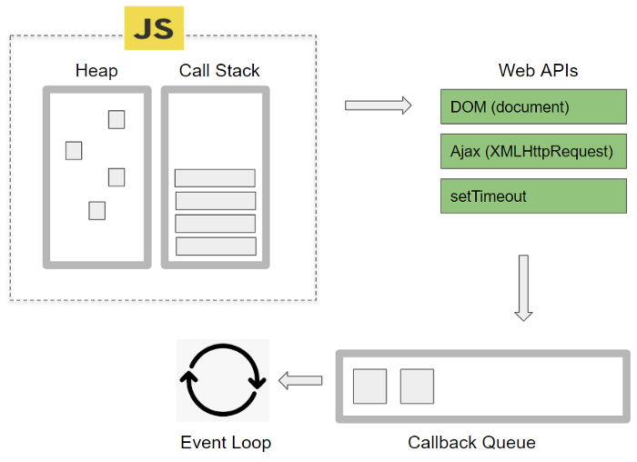
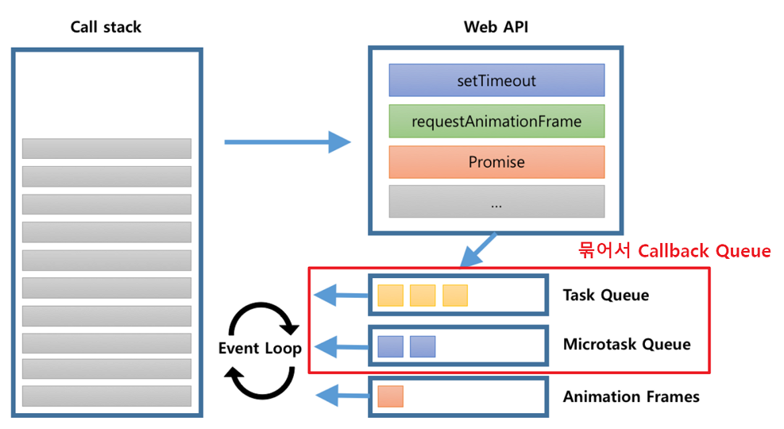

# 자바스크립트 비동기

## 비동기 처리
비동기 처리란 특정 작업이 완료될 때까지 기다리지 않고 다음 작업을 수행하는 방식

**주 사용처**
- 서버와의 통신
- 타이머 함수

# promise
- 비동기 작업의 완료 또는 실패를 나타내는 객체

## 기본 사용법
```js
const promise = new Promise((resolve, reject) => {
  // 비동기 작업
  if (성공) {
    resolve(결과);
  } else {
    reject(에러);
  }
});
```
## promise의 상태
promise는 3가지 상태를 가짐
| 상태          | 설명                  |
| ----------- | ------------------- |
| `pending`   | 대기 중                |
| `fulfilled` | 작업 성공 (resolve 호출됨) |
| `rejected`  | 작업 실패 (reject 호출됨)  |

### 사용예시
```js
const getData = () => {
  return new Promise((resolve, reject) => {
    setTimeout(() => {
      resolve('성공');
    }, 1000);
  });
};

getData().then((result) => {
  console.log(result); // 성공
});
```

**.then(): 성공 시 호출, fulfilled 상태**
**.catch(): 실패 시 호출, rejected 상태**
**.finally(): 무조건 호출 (성공/실패와 관계없이)**
```js
promise
  .then(result => console.log(result))
  .catch(error => console.error(error))
  .finally(() => console.log("작업 종료"));
```

**체이닝**
```js
getData()
  .then((result) => {
    console.log(result); // "성공"
    return '다음 작업';
  })
  .then((next) => {
    console.log(next); // "다음 작업"
  });
```
- 각 `.then()`은 새로운 Promise를 반환합니다. 그래서 연속적으로 작업을 이어갈 수 있습니다.

## 에러 원칙
Promise 체이닝 중 어디서든 `reject`나 `throw`가 발생하면 `.catch()`로 전달됩니다.

```js
Promise.resolve()
  .then(() => {
    throw new Error("문제 발생!");
  })
  .catch((err) => {
    console.error("에러 잡힘:", err.message);
  });
```

### Promise.all, Promise.race, Promise.allSettled, Promise.any

### `Promise.all([])`
- 모든 Promise가 성공해야 then으로 감
- 하나라도 실패하면 catch
```js
Promise.all([promise1, promise2]).then(([r1, r2]) => {
  console.log(r1, r2);
});
```

### `Promise.race([])`
- 가장 먼저 끝난 Promise의 결과를 반환
```js
Promise.race([slowPromise, fastPromise]).then(result => console.log(result));
```

### `Promise.allSettled([])`
성공/실패와 관계없이 모든 결과를 배열로 반환
```js
Promise.allSettled([p1, p2]).then(results => {
  results.forEach(r => console.log(r.status, r.value || r.reason));
});
```

### `Promise.any([])`
- 하나라도 성공하면 성공 반환
- 모두 실패해야만 reject


## promise 지옥
지옥예제
```js
fetch("https://api.github.com/users")
  .then((response) => {
    if (response.ok) {
      return response.json();
    } else {
      throw new Error("Network Error");
    }
  })
  .then((users) => {
    return users.map((user) => user.login);
  })
  .then((logins) => {
    return logins.join(", ");
  })
  .then((result) => {
    console.log(result);
  })
  .catch((error) => {
    console.error(error);
  });
```
- `then()` 메서드가 과도하게 체인되어 코드 가독성이 떨어지고, 중간 에러 처리가 어려움
- promise 지옥 해결법으로 async & await으로 가독성

# async & await 사용법
- `async`와 `await`는 자바스크립트의 최신 비동기 처리 문법
- 코드를 동기적으로 작성한것 처럼 보이게 함

```js
async function fetchGitHubUsers() {
  try {
    const response = await fetch("https://api.github.com/users");

    if (response.ok) {
      const users = await response.json();
      const logins = users.map((user) => user.login);
      const result = logins.join(", ");
      console.log(result);
    } else {
      throw new Error("Network Error");
    }

  } catch (error) {
    console.error(error);
  }
}

fetchGitHubUsers();
```

## async 함수 선언
- 함수 앞에 async 키워드를 붙인다.
- 리턴값은 promise 객체
- return 값을 명시해주지 않으면 자동으로 `undefined` 반환

## await 키워드
- `await` 키워드 `async`함수 내부에서만 사용
- `await` 프로미스가 처리될 때까지 함수 실행을 일시 중지

## 기본 사용법
- 비동기 함수 정의 및 호출
```js
function fetchUser(url) {
    return fetch(url).then(response => response.json());  // HTTP 요청을 보내고 프로미스 반환
}

async function logName() {             // (1) async 함수 선언
  var user = await fetchUser('domain.com/users/1');  // (3) 프로미스가 처리될 때까지 기다림
  if (user.id === 1) {               // (4) 프로미스 처리 후 실행될 코드
      console.log(user.name);        // (5) 콘솔에 출력
  }
}

logName();                             // (2) async 함수 호출
```


## 고급 활용
```js
//병렬 실행 (parallel)
const [res1, res2] = await Promise.all([fetch1(), fetch2()]);
//병렬 실행 2
async function getFruits() {
  let applePromise = getApple(); // 논블록킹 실행
  let bananaPromise = getBanana(); // 논블록킹 실행

  let a = await applePromise; // 프로미스 결과를 기다림
  let b = await bananaPromise; // 프로미스 결과를 기다림

  console.log(`${a} and ${b}`); // 총 1초 소요
}

getFruits();
//순차 실행 (sequential)
const res1 = await fetch1();
const res2 = await fetch2();

//에러 발생시 다음 promise는 실행 안됨
await Promise.reject('에러'); // 여기서 멈춤
await fetch();               // 실행 안됨

//커스텀 지연 함수
const delay = (ms) => new Promise(resolve => setTimeout(resolve, ms));
await delay(1000); // 1초 지연

//조건부 resolve/reject
const login = (isValid) => new Promise((resolve, reject) => {
  isValid ? resolve("로그인 성공") : reject("로그인 실패");
});
```
## 실제 사용 예 (API 요청)
```js
const fetchUser = async (id) => {
  try {
    const res = await fetch(`https://api.example.com/user/${id}`);
    if (!res.ok) throw new Error('네트워크 에러');
    const data = await res.json();
    return data;
  } catch (err) {
    console.error('에러 발생:', err);
    throw err;
  }
};
```


# 이벤트 루프
이벤트 루프는 자바스크립트가 싱글 스레드 환경에서도 비동기 작업을 효과적으로 처리할 수 있도록 돕는 핵심 메커니즘입니다. 이벤트 루프는 브라우저 내부의 Call Stack, Callback Queue, Web APIs 등을 모니터링하며 비동기 작업들을 관리합니다.

1. Call Stack: 자바스크립트 함수 호출이 쌓이는 스택입니다.
2. Web APIs: 타이머, 네트워크 요청 등을 처리하는 브라우저의 API입니다.
3. Callback Queue: 비동기 작업이 완료되면 해당 콜백 함수가 이 큐에 추가됩니다.
4. Event Loop: 호출 스택이 비어 있을 때 콜백 큐에서 콜백 함수를 꺼내 호출 스택에 추가하여 실행합니다.

## 자바스크립트 엔진 구동 환경

- Call Stack: 자바스크립트 엔진이 코드 실행을 위해 사용하는 메모리 구조.
- Heap: 동적으로 생성된 자바스크립트 객체가 저장되는 공간.
- Web APIs: 비동기 작업을 처리하는 브라우저 API 모음 (AJAX 호출, 타이머 함수, DOM 조작 등).
- Callback Queue: 비동기 작업이 완료되면 실행되는 함수들이 대기하는 공간.
- Event Loop: 비동기 함수들을 적절한 시점에 실행시키는 관리자.
- Event Table: 특정 이벤트 발생 시 어떤 콜백 함수가 호출되는지를 알고 있는 자료구조.

## Callback Queue의 종류

### Task Queue (macrotask queue)
- **역할**: 비동기적으로 처리되는 함수들의 콜백 함수가 들어가는 큐
- **예시**: setTimeout, setInterval, fetch, addEventListener
### Microtask Queue
- 역할: 우선적으로 비동기 처리되는 함수들의 콜백 함수가 들어가는 큐
- 예시: promise.then, process.nextTick, MutationObserver

이벤트 루프는 일반적으로 **microtask queue를 먼저 처리한 후, task queue**를 처리합니다. 따라서 **Promise.then의 결과가 setTimeout**보다 먼저 처리됩니다. 같은 큐 안에서도 우선순위가 다른 작업들이 있을 수 있습니다.

## 이벤트 루프 동작 과정
동작 과정
1. 동기 작업 실행: 콜 스택에 쌓인 동기 작업을 순차적으로 실행합니다.
1. 비동기 작업 처리: 비동기 함수 호출 시, 해당 작업은 웹 API에서 처리되고, 완료된 콜백 함수는 콜백 큐에 적재됩니다.
1. 이벤트 루프 작동: 이벤트 루프는 콜 스택이 비어 있는지 확인한 후, 비어 있다면 콜백 큐에서 대기 중인 콜백 함수를 콜 스택으로 옮겨 실행합니다.
1. 마이크로태스크 우선 처리: 이벤트 루프는 태스크 큐보다 마이크로태스크 큐를 우선적으로 처리합니다. 마이크로태스크 큐가 비워진 후에 태스크 큐를 처리합니다.

## async/await 변환 예시

```js
let x = await bar(); // bar() 함수 정의는 생략
console.log(x);
console.log('Done');

//변환 시
bar().then(x => { 
    console.log(x); 
    console.log('Done'); 
});
```

## MicroTask Queue의 무한 루프
taskqueue로 구현된 루프
```js
document.getElementById("btn2").addEventListener("click", () => {
  // setTimeout 함수는 Task Queue에 콜백을 추가
  function loop() {
    setTimeout(() => {
      document.getElementById("loopArea").append("Loop\n");
      loop(); // loop 함수가 setTimeout 객체의 콜백으로 자신을 계속해서 추가
    }, 0);
  }

  // loop 함수를 호출
  loop();
});
```
- 실행하면 문제없이 루프가 시작된다

microtask queue로 구현된 루프
```js
document.getElementById("btn2").addEventListener("click", () => {
  // Promise 객체는 MicroTask Queue에 콜백을 추가
  function loop() {
    Promise.resolve().then(() => {
      document.getElementById("loopArea").append("Loop\n");
      loop(); // loop 함수가 Promise 객체의 콜백으로 자신을 계속해서 추가
    });
  }

  // loop 함수를 호출
  loop();
});
```
- 실행하면 웹 사이트가 먹통이 된다
- 똑같은 루프지만 브라우저를 렌더링 하기전에 microtask queue가 비어있지 않으므로 다른 이벤트콜백들이 실행 될 수 없기 때문이다.

## 좀더 자세히 보면 좋은 곳
[링크](https://inpa.tistory.com/entry/%F0%9F%94%84-%EC%9E%90%EB%B0%94%EC%8A%A4%ED%81%AC%EB%A6%BD%ED%8A%B8-%EC%9D%B4%EB%B2%A4%ED%8A%B8-%EB%A3%A8%ED%94%84-%EA%B5%AC%EC%A1%B0-%EB%8F%99%EC%9E%91-%EC%9B%90%EB%A6%AC)
